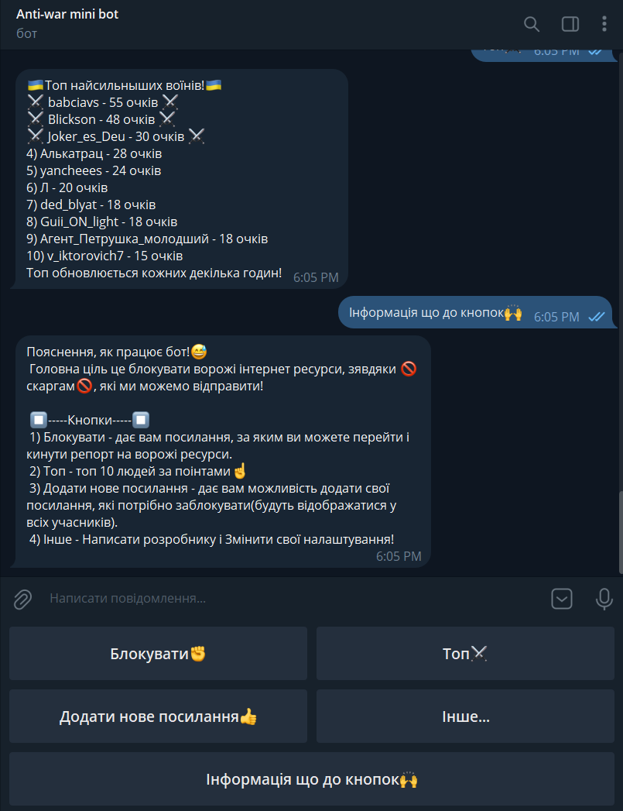

<h1 align="center">
  <br>
   
  <br>
</h1>

<p align="center">
    <b align ="center">Telegram bot for blocking channels, thanks to people's complaints.</b>
</p>

## Table of Contents
1. [Introduction](#Introduction)
2. [Introduction Ua](#Introduction-ua)
3. [Preview of work](#Preview-of-work)
4. [How to install](#How-to-install)
5. [How to use](#How-to-use)


## <a name="Introduction">Introduction</a>
The purpose of this bot is to provide the user with links to propaganda sources against which to file a complaint. In order to block such sources.

## <a name="Introduction-ua">Introduction Ua</a>
В Україні на даний момент відбувається війна з Росією. Проте слід зазначити, що вона відбувається не тільки на фронті, а й в наших смартфонах. Тому ціль даного бота полягає в том, щоб надавати користувачу посилання на пропагандистські джерела на, які можна подати скаргу. 

### Головні цілі проєкта:
*	Боротьба з дезінформацією: В даний час дезінформація та фейк-ньюз стали серйозною проблемою. Пропагандистські джерела можуть ширити неправдиву, маніпулятивну або впливаючу інформацію, яка може негативно впливати на громадську думку, політичний процес та суспільство загалом. Можливість подати скаргу на такі джерела є важливим кроком у боротьбі з дезінформацією та зміцненням достовірності інформації.

*	Захист прав та інтересів користувачів: Користувачі повинні мати можливість впливати на якість інформації, яку вони споживають. Забезпечення можливості подання скарг на пропагандистські джерела дає користувачам засіб впливу, щоб висловити своє несхвалення щодо неправдивої чи маніпулятивної інформації та вимагати дій відповідних організацій чи платформ.

*	Посилення прозорості та відповідальності: Подання скаргу на пропагандистські джерела викликає необхідність проведення перевірки та вжиття заходів щодо відповідності їхньої діяльності етичним та нормативним стандартам. Це може сприяти зміцненню прозорості та відповідальності з боку засобів масової інформації та публічних платформ.

## <a name="Preview-of-work">Preview of work</a>
<details open>
<summary>
 Images
</summary> <br/>

<p align="center">
    
&nbsp;
    
</p>

<p align="center">
    
&nbsp;
    
</p> 
    
<p align="center">
    
&nbsp;
    
</p>

</details>

## <a name="How-to-install">How to install</a>
* Download and open project in VS
* Download in project next NuGet package: Telegram.Bot
* Register your bot in **[Telegram BotFather](https://telegram.me/BotFather)**.
* Change id bot in Program.cs:
```C#
  private static string token { get; set; } = "YOUR_ID_TELEGRAM_BOT";
```
* Start program and close
* Next step find where build your exe file and add in this place BaseData.zip and extract here
```Path
//Standart path build exe file:
*\TelegramBot_BlockChannel-main\TelegramBot_BlockChannel-main\Anti-war-mini_bot\bin\Debug\net5.0
```
* Use bot!
  
## <a name="How-to-use">How to use</a>

To use the bot, follow the instructions in the console. 
### The classic version:
* 0 - start the bot
* 8 - upload data for the bot
* 1 - create top users

When to close the bot:
* 9 - save bot data
* 10 - close the program
